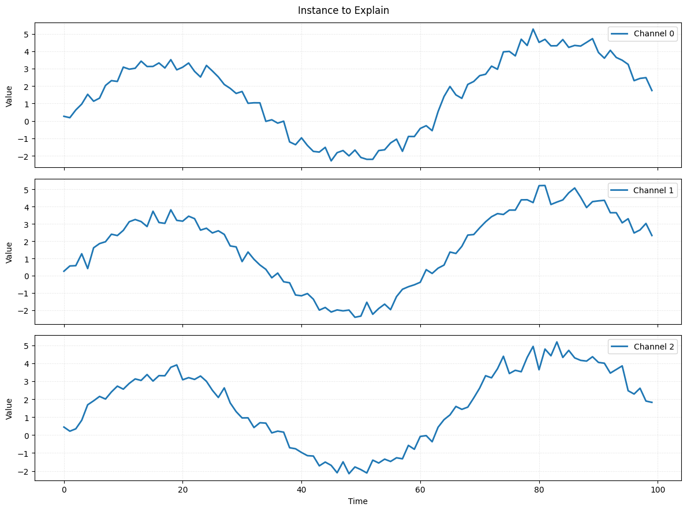
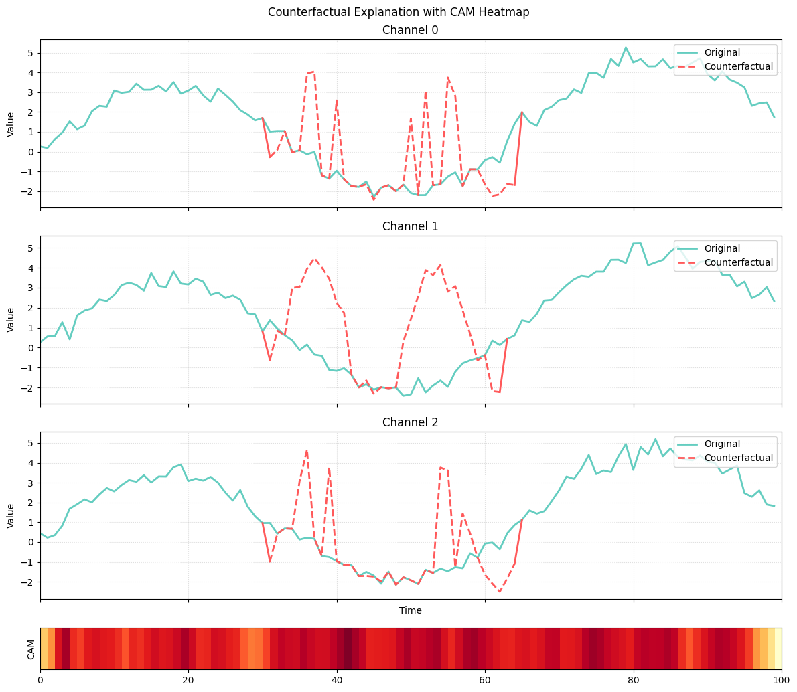

Example
========

Counterfactual explanations offer an intuitive way to explore how a model’s
prediction could change under minimal modifications of the input. Given an
instance and a target class, a counterfactual answers the question:

    *“What is the smallest and most plausible change in this time series that
    would cause the model to predict a different outcome?”*

For multivariate time series, this typically means altering only a short
subsequence or specific channels while keeping the overall structure intact.
Counterfactuals complement traditional attribution methods by not only
highlighting **why** a decision was made, but also illustrating **how** it
could have been different.

This example walks through the full CONFETTI pipeline for generating such
counterfactual explanations, including:

- generating a synthetic multivariate time series dataset
- training a lightweight FCN classifier
- optionally extracting CAM-based feature-importance weights
- generating counterfactual candidates
- visualizing the resulting explanations

------------------------------------------------------------
1. Generate a Toy Multivariate Time Series Dataset
------------------------------------------------------------

We begin by creating a small synthetic dataset with two classes.
Each class has a distinct temporal pattern so that a small FCN can achieve
reasonable accuracy.

.. code-block:: python

    import numpy as np
    from pathlib import Path
    from confetti.utils import save_multivariate_ts_as_csv

    def generate_toy_dataset(
        n_samples=200, timesteps=100, channels=3, random_state=123
    ):
        rng = np.random.default_rng(random_state)

        X = np.zeros((n_samples, timesteps, channels))
        y = np.zeros(n_samples, dtype=int)

        # Define class patterns
        for i in range(n_samples):
            if i < n_samples // 2:
                # Class 0
                base = np.linspace(0, 2, timesteps)                         # rising trend
                signal = 3.0 * np.sin(np.linspace(0, 3*np.pi, timesteps))   # low freq
                noise = 0.3 * rng.normal(size=(timesteps, channels))
                X[i] = base[:, None] + signal[:, None] + noise
                y[i] = 0
            else:
                # Class 1
                base = np.linspace(2, 0, timesteps)                         # falling trend
                signal = 3.0 * np.sin(np.linspace(0, 12*np.pi, timesteps))  # high freq
                noise = 0.3 * rng.normal(size=(timesteps, channels))
                X[i] = base[:, None] + signal[:, None] + noise
                y[i] = 1

        return X, y

    # Create dataset
    X, y = generate_toy_dataset()

    # Shuffle before split
    indices = np.arange(len(X))
    np.random.shuffle(indices)
    X, y = X[indices], y[indices]

    # 80/20 split
    split = int(0.8 * len(X))
    X_train, y_train = X[:split], y[:split]
    X_test, y_test = X[split:], y[split:]

    print("Train:", X_train.shape, y_train.shape)
    print("Test: ", X_test.shape, y_test.shape)

.. code-block:: text

    Train: (160, 100, 3) (160,)
    Test:  (40, 100, 3) (40,)

------------------------------------------------------------
2. Build a Lightweight FCN Classifier
------------------------------------------------------------

Below is a small FCN-like model designed for example usage.

.. code-block:: python

    import keras
    from keras import layers
    import numpy as np
    from pathlib import Path

    class ToyFCN:

        def __init__(self, input_shape, num_classes=2):
            self.input_shape   = input_shape
            self.num_classes   = num_classes
            self.model_path    = Path("toy_fcn.keras")
            self.model         = self._build_model()

        def _build_model(self):
            inputs = keras.layers.Input(shape=self.input_shape)

            # Conv block 1
            x = layers.Conv1D(filters=16, kernel_size=8, padding="same")(inputs)
            x = layers.BatchNormalization()(x)
            x = layers.ReLU()(x)

            # Conv block 2
            x = layers.Conv1D(filters=32, kernel_size=5, padding="same")(x)
            x = layers.BatchNormalization()(x)
            x = layers.ReLU()(x)

            # Conv block 3
            x = layers.Conv1D(filters=16, kernel_size=3, padding="same")(x)
            x = layers.BatchNormalization()(x)
            x = layers.ReLU()(x)

            # Global average pooling
            gap = layers.GlobalAveragePooling1D()(x)

            # Output layer
            outputs = layers.Dense(self.num_classes, activation="softmax")(gap)

            model = keras.Model(inputs=inputs, outputs=outputs)
            model.compile(
                optimizer="adam",
                loss="sparse_categorical_crossentropy",
                metrics=["accuracy"],
            )
            return model

        def fit(self, X_train, y_train, epochs=20, batch_size=16, verbose=1):
            self.model.fit(
                X_train,
                y_train,
                epochs=epochs,
                batch_size=batch_size,
                verbose=verbose,
                validation_split=0.2,
            )
            self.model.save(self.model_path)
            return self.model

        def predict(self, X):
            proba = self.model.predict(X)
            return np.argmax(proba, axis=1)

        def predict_proba(self, X):
            return self.model.predict(X)

------------------------------------------------------------
3. Train the FCN Model
------------------------------------------------------------

.. code-block:: python

    input_shape = X_train.shape[1:]
    num_classes = len(np.unique(y_train))

    model = ToyFCN(input_shape=input_shape, num_classes=num_classes)

    print("Training ToyFCN...")
    model.fit(X_train, y_train, epochs=20, batch_size=16, verbose=1)

    accuracy = (model.predict(X_test) == y_test).mean()
    print(f"Test accuracy: {accuracy:.3f}")

.. code-block:: text

    Test accuracy: 1.000

------------------------------------------------------------
4. Generate Counterfactual Explanations with CONFETTI
------------------------------------------------------------
Lets visualize the instance we want to explain.

.. code-block:: python

    instance = X_test[0:1]
    plot_time_series(series=instance_to_explain, title="Instance to Explain")

Now we apply CONFETTI to generate a counterfactual for a single instance.

.. code-block:: python

    from confetti import CONFETTI
    from confetti.attribution import cam

    weights = cam(model.model, X_train)

    instance = X_test[0:1]

    explainer = CONFETTI(model_path="toy_fcn.keras")

    results = explainer.generate_counterfactuals(
        instances_to_explain=instance,
        reference_data=X_train,
        reference_weights=weights,
        alpha=0.5,
        theta=0.51,
    )

    cf_set = results[0]
    print("Original label:     ", cf_set.original_label)
    print("Counterfactual label:", cf_set.best.label)
    print("Total generated:     ", len(cf_set.all_counterfactuals))

.. code-block:: text

    Original label:      0
    Counterfactual label: 1
    Total generated:      11

The returned ``CounterfactualResults`` object contains several attributes, including the original instance, generated candidates, the best counterfactual, and CAM importance values (when available).

------------------------------------------------------------
5. Visualize the Counterfactual Explanation
------------------------------------------------------------

Finally, we visualize the best counterfactual and optional CAM heatmap.

.. code-block:: python

    from confetti.visualizations import plot_counterfactual

    plot_counterfactual(
        original=cf_set.original_instance,
        counterfactual=cf_set.best.counterfactual,
        cam_weights=cf_set.feature_importance,
        cam_mode="heatmap",
        title="Counterfactual Explanation",
    )

The plot shows how CONFETTI generates a counterfactual by selectively modifying only the most relevant part of the time series.
The green curves represent the original instance across all channels, while the red curves show the counterfactual subsequence inserted by the method.
The heatmap at the bottom corresponds to the class activation map (CAM) of the nearest unlike neighbor (NUN), which indicates the time region the model relies on most when predicting the *new* class.
CONFETTI uses this CAM as a guide, focusing its perturbation on the segment most responsible for distinguishing the NUN’s class from the original.
The alignment between the high-activation region in the CAM and the red counterfactual subsequence illustrates how the method leverages attribution to produce focused and meaningful counterfactual changes.
