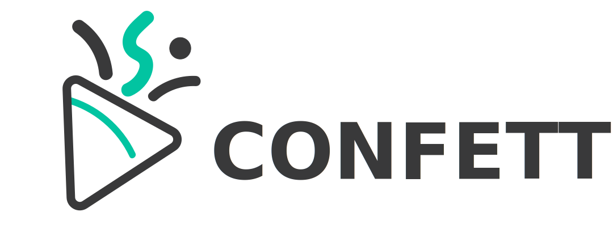

Counterfactual Explanations for Multivariate Time Series
==================================================================

**CONFETTI** is a multi-objective method for generating **counterfactual explanations for multivariate time series**. 
It identifies the most influential temporal regions, builds an initial perturbation using the nearest unlike neighbour (NUN), 
and optimizes it under multiple objectives to produce explanations that are **sparse**, **realistic**, and 
**confidence-increasing**.

The method is model-agnostic and works with any **Keras/Scikit-learn** classifier.
CONFETTI integrates seamlessly with modern deep learning pipelines and supports optional class activation map (CAM) extraction to guide the perturbation process.

Installation
------------

To install the PyPI release:

.. code-block:: bash

    pip install confetti-ts

Features
--------
- 🐍 Compatible with Python 3.12+
- 🎯 Multi-objective counterfactual generation using NSGA-III
- 🤖 Works with any Keras or scikit-learn multivariate time series classifier
- 🔥 Optional use of CAMs for feature-weighted perturbations
- ⚡ Parallelized counterfactual generation
- 🧪 Generates multiple candidate counterfactuals per instance
- 🧰 Built-in utilities for:

  - 📄 loading and preparing time series datasets
  - 🔍 extracting CAM feature weights
  - 📊 visualizing generated explanations

License
-------

CONFETTI is released under the terms of the MIT License.

.. toctree::
   :hidden:
   :maxdepth: 2

   usage
   example
   api/index
